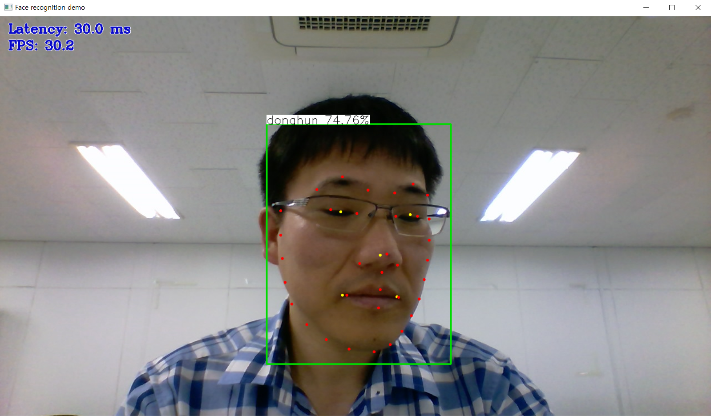

# Face Recognition Python\* Demo + Gaze Estimation Demo

## 미니 프로젝트 개요

Face Recognition 예제는 노트북 카메라 등에서 들어온 영상에서 얼굴(face)을 탐지하여, 누구 인지를 식별합니다. 여기에 추가로 Gaze Estimation를 수행하여, 사람이 어디를 바라보고 있는 지까지 인식하고자 하는 미니 프로젝트입니다.

추후 이를 활용하여, 노트북 모니터에 달린 웹캠을 바라 보고 있는 사람이 노트북에 화면에 어디를 주시하고 있는 지, 알 수 있는 응용프로그램을 개발하고자 합니다. 이를 위해서 해당 미니 프로젝트를 구상하게 되었습니다.

다음의 사전학습된 모델을 사용할 예정:

* Face Recognition Python
  * `face-detection-retail-0004`, 얼굴을 찾고 바운딩 박스를 생성함;
  * `landmarks-regression-retail-0009`, 얼굴에 특징점(5개) 추출
  * `face-reidentification-retail-0095`, 사람 인식
* Gaze Estimation
  * `facial-landmarks-35-adas-0002`, 얼굴에 특징점(35개) 추출
  * `head-pose-estimation-adas-0001`, 머리에 자세 추정
  * `open-closed-eye-0001`, 눈에 움직임 탐지
  * `gaze-estimation-adas-0002`, 시선 추정

## 동작 방식

1. face-detection-retail-0004 모델을 통해서 얼굴을 추출
2. 얼굴을 입력으로, landmarks-regression-retail-0009 모델에서 얼굴에 특징점을 추출
3. face-reidentification-retail-0095 모델에서 특징점을 기존 얼굴 정보와 비교하여 사람을 식별
4. 2번 동작으로 뽑은 얼굴을 입력으로, landmarks-regression-retail-0009 모델에서 얼굴에 상세한 특징점을 추출
5. 2번 동작으로 뽑은 얼굴을 입력으로, head-pose-estimation-adas-0001 모델에서 머리에 자세를 추정
6. 4번 동작으로 뽑을 눈을 입력으로, open-closed-eye-0001 모델에서 눈의 움직임을 탐지
7. 4~6번 동작으로 뽑은 정보를 바탕으로, gaze-estimation-adas-0002 모델에서 사람의 시선을 추정

## 구현 진행 사항

* Face Recognition Python
  * face-detection-retail-0004
  * landmarks-regression-retail-0009
  * face-reidentification-retail-0095
* Gaze Estimation(C++로 구현되어 있기 때문에, 모델만 가져와서 사용함)
  * facial-landmarks-35-adas-0002
  * head-pose-estimation-adas-0001(구현 중)
  * open-closed-eye-0001(미구현)
  * gaze-estimation-adas-0002(미구현)

각 모델에 입출력 데이터타입을 이해(머리의 자세나 시선을 나타내기 위한 좌표계 등)하고 맞추는 것에 상당한 시간이 걸렸습니다. 이로 인해 개발이 빠르게 진행 되지 못했습니다.

## 실행

Windows (`cmd`, `powershell`)에서 실행한 명령어:

``` sh
python face_recognition_demo.py -i 0 -m_fd intel\face-detection-retail-0004\FP16\face-detection-retail-0004.xml -m_lm intel\landmarks-regression-retail-0009\FP16\landmarks-regression-retail-0009.xml -m_lme intel\facial-landmarks-35-adas-0002\FP16\facial-landmarks-35-adas-0002.xml -m_reid intel\face-reidentification-retail-0095\FP16\face-reidentification-retail-0095.xml --verbose -fg "face_gallery"
```

## 실행화면



얼굴에 나타난 5개의 특징점(노란색)에, 추가로 35개에 상세한 특징점(빨간색)이 표현되고 있습니다.
